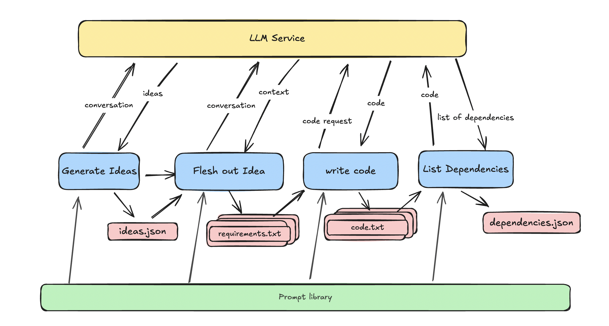

# LLM Coding Analysis

A Python tool for analyzing code generated by Large Language Models (LLMs) to determine which frameworks are being used for particular coding requests.

Currently it only analyzes dependencies and outputs how often a particular framework is used




## Features

- Generate product ideas using LLM models
- Convert product ideas into detailed requirements
- Generate code implementations based on requirements
- Analyze and track frameworks used in generated code
- Comprehensive dependency tracking and analysis
- Flexible workflow with ability to start from any step
- Custom working directory naming

## Requirements

- Python 3.10 or higher
- OpenRouter API key

## Installation

1. Clone the repository:
```bash
git clone https://github.com/jessewhite/llm-coding-analysis.git
cd llm-coding-analysis
```

2. Create and activate a virtual environment:
```bash
python3 -m venv .venv
source .venv/bin/activate  # On Windows, use: .venv\Scripts\activate
```

3. Install the package:
```bash
pip install -e .
```

## Usage

Run the analysis with default settings:
```bash
llm-coding-analysis --api-key your-api-key-here
```

Customize the run with command-line options:
```bash
llm-coding-analysis \
    --config path/to/config.json \
    --model anthropic/claude-2 \
    --output-dir custom/output/path \
    --log-level DEBUG \
    --start-step 2 \
    --working-dir my-project
```

### Available Steps

The tool follows a 4-step process:
1. Ideas Generation (`--start-step 1` or `--start-step ideas`)
2. Requirements Analysis (`--start-step 2` or `--start-step requirements`)
3. Code Generation (`--start-step 3` or `--start-step code`)
4. Dependencies Collection (`--start-step 4` or `--start-step dependencies`)

You can start from any step using the `--start-step` argument. The tool will assume that any necessary files from previous steps are already present in the working directory.

### Working Directory

By default, the tool creates a timestamped directory for each run. You can specify a custom directory name using the `--working-dir` argument:

```bash
llm-coding-analysis --working-dir my-project
```

## (optional) Configuration
You can use a config file for values as opposed to passing items on the command line
1. Create a copy of the default configuration:
```bash
cp src/config/default_config.json config.json
```

2. Edit the configuration file with your settings:
```json
{
    "openrouter": {
        "api_key": "your-api-key-here",
        "default_model": "anthropic/claude-2",
        "timeout": 60,
        "max_retries": 3
    },
    "output": {
        "base_dir": "output",
        "ideas_filename": "ideas.json",
        "dependencies_filename": "dependencies.json"
    }
}
```

## Output Structure

The tool creates a working directory (timestamped or custom-named) for each run under the output directory:
```
output/
└── working-dir/
    ├── ideas.json
    ├── requirements/
    │   └── requirements_*.txt
    ├── code/
    │   └── generated_files
    └── dependencies.json
```

## Dependencies Analysis

The tool uses LLM to analyze code files and identify frameworks used. Key features:
- All code files are processed as .txt files for consistency
- LLM analyzes the code to identify frameworks and libraries
- Tracks usage frequency of each framework
- Framework detection is language-agnostic and based on LLM analysis

Example dependencies.json:
You can see a full run output in `docs/example_output`
```json
{
    "frameworks": [
        {
            "name": "Ruby on Rails",
            "count": 2
        },
        {
            "name": "PostgreSQL",
            "count": 1
        },
        {
            "name": "Vue.js",
            "count": 1
        }
    ]
}
```

The dependency analysis process:
1. Code files are read as text
2. Each file is analyzed by the LLM to extract a list of frameworks
3. Results are aggregated and framework counts are updated
4. Final results are saved in dependencies.json

## Development

1. Install development dependencies:
```bash
pip install -r requirements.txt
```

2. Run tests:
```bash
pytest
```

3. Run linting:
```bash
flake8 src tests
black src tests
mypy src tests
```

4. Guidelines for AI Coding Agents
Ensure the Coding Agent uses the [AI Rules and Guidelines](docs/AI_RULES_AND_GUIDELINES.md) in every request
